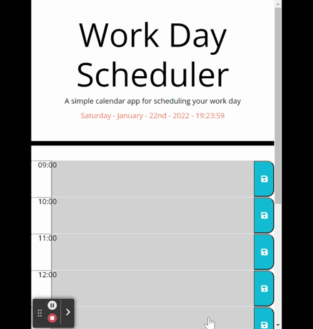
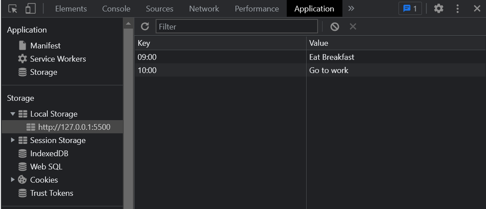

# Daily Planner

## Description
This project is a work day scheduler that uses multiple API's such as Bootstrap, jQuery and MomentJS to create a dynamic scheduler. Using MomentJS the page can be styled based on real time and will display the current date with a running clock. Local storage is used to allow input written to each 'time block' to remain on the page even after refreshing.

The page is styled using both Bootstrap classes and local CSS in combination.

## Technologies
HTML, CSS, Javascript, jQuery, MomentJS and Bootstrap were used to create this project. The design is responsive through the use of Bootstrap.

---

## Screenshots

 

 

---

## Links

 

Github deployed application - [daily-planner](https://ryocon.github.io/daily-planner/)

Github repository - [Ryocon/daily-planner](https://github.com/Ryocon/daily-planner)
